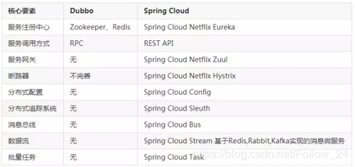
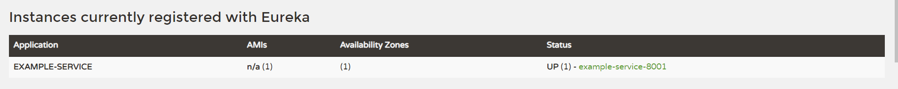
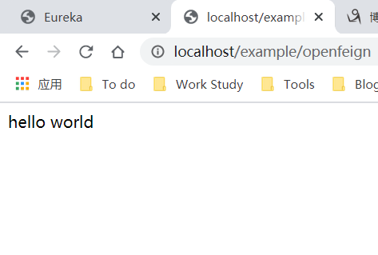

<!--
 * @Author: Yintianhao
 * @Date: 2020-07-16 18:02:15
 * @LastEditTime: 2020-07-16 19:51:54
 * @LastEditors: Yintianhao
 * @Description: 
 * @FilePath: \TechNote\src\Blog\20200716-Eureka+OpenFeign.md
 * @Copyright@Yintianhao
--> 
## 前言
在毕业之前我还没比较系统地去了解SpringCloud生态，只用过Dubbo和Zookeeper来实现几个简单的服务来调用玩一玩，后来逐渐了解到SpringCloud生态，其实严格来讲把Dubbo和Zookeeper和SpringCloud放在一起比较并不合适，因为Dubbo是一个个rpc框架，Zookeeper是注册中心，而这两个只是SpringCloud整套中间的两个组成部分。在SpringCloud生态中有Eureka来当注册中心，有OpenFeign来做服务间的调用，值得一提的是dubbo是RPC，OpenFeign是Http。这里贴一张网上找到的Dubbo和SpringCloud的对比。        
          
所以今天结合Eureka和OpenFeign做一个简单的消费者服务调用生产者服务的小Demo。     
## Eureka
跟Zookeeper不同的是，Eureka没有安装包，而是以集成服务中来起作用，所以在创建父工程之后单独创建一个Eureka注册中心模块来提供给生产者注册。         
Eureka服务的pom文件需要加入Eureka服务端的依赖，除此之外就是一些常用的SpringBoot依赖。
```
 <dependencies>
        <!-- eureka-server -->
        <dependency>
            <groupId>org.springframework.cloud</groupId>
            <artifactId>spring-cloud-starter-netflix-eureka-server</artifactId>
        </dependency>
        <!--web-->
        <!--actuator-->
        <!-- lombok -->
        ......
    </dependencies>

```
然后就是application.yml了，这里面规定服务端口，Eureka的基本设置等。
```
server:
  port: 7001

eureka:
  instance:
    hostname: localhost
  client:
  # 不向注册中心注册自己
    register-with-eureka: false
  # 表示自己端是注册中心
    fetch-registry: false
    service-url:
  # 设置与Eureka Server交互的地址查询服务和注册服务需要依赖这个地址
      defaultZone: http://${eureka.instance.hostname}:${server.port}/eureka/
  server:
  # 关闭自我保护的时间
    enable-self-preservation: false
    eviction-interval-timer-in-ms: 2000
```
之后就是主启动类加上@SpringBootApplication
和@EnableEurekaServer就行，因为这个服务只作为注册中心，所以也没有其他业务类，到这里注册中心就搞定了。
## Provider生产者端
与上面Eureka服务端不同的是，生产者端需要加入Eureka客户端的依赖。
```
.....
        <dependency>
            <groupId>org.springframework.cloud</groupId>
            <artifactId>spring-cloud-starter-netflix-eureka-client</artifactId>
        </dependency>
......
```
### Application.yml
这里需要定义工程名以便消费者能够它来进行服务调用，除此之外就是定义Eureka的配置。
```
server:
  port: 8001


spring:
  application:
    name: example-service

eureka:
  instance:
    instance-id: example-service-8001
    prefer-ip-address: true
    # Eureka客户端向服务端发送心跳包的时间间隔
    lease-renewal-interval-in-seconds: 1
    # Eureka服务端在收到最后一次心跳包后等待时间上限
    lease-expiration-duration-in-seconds: 2
  client:
    register-with-eureka: true
    fetch-registry: true
    service-url:
      defaultZone: http://localhost:7001/eureka
```
为了简单，生产者端不写DAO和Service层了，只有Controller层，返回一个简单的"Hello world"，所以定义一个Controller类。
```
@Controller
public class OpenFeignController {

    @GetMapping("/example/openfeign")
    public String helloworld(){
        return "hello world";
    }

```
主启动类加上@SpringBootApplication
和@EnableEurekaClient，随后启动该服务，检查Eureka页面是否有该服务注册。

## Consumer消费者端
消费者端主要是需要调用刚才的/example/openfeign接口，所以除了Eureka的依赖，还需要OpenFeign的依赖。
```
......
        <!-- openfeign -->
        <dependency>
            <groupId>org.springframework.cloud</groupId>
            <artifactId>spring-cloud-starter-openfeign</artifactId>
        </dependency>
        <!--eureka client-->
        <dependency>
            <groupId>org.springframework.cloud</groupId>
            <artifactId>spring-cloud-starter-netflix-eureka-client</artifactId>
        </dependency>
......
```
在这之后，既然有了注册中心，那么就要告诉消费者端注册中心的地址，自然就要加入yml的配置。
### Application.yml
```
server:
  port: 80

eureka:
  client:
    register-with-eureka: false
    service-url:
      defaultZone: http://localhost:7001/eureka
......
```
然后就是最重要的Service层了，这里面实现调用生产者接口。
```
@Component
@FeignClient(value = "EXAMPLE-SERVICE")
public interface ExampleService {
    @GetMapping("/example/openfeign")
    public String helloworld();
}
```
然后写Controller层调用Service层的helloworld方法。
```
@RestController
public class ExampleFeignController {

    @Resource
    private ExampleService exampleService;

    @GetMapping("/example/openfeign")
    public String helloworld(){
        return exampleService.helloworld();
    }
}
```
最后，在这个服务的主启动类中加入@SpringBootApplication 
@EnableFeignClients注解来启用OpenFeign。
## 测试消费者端
在浏览器输入http://localhost/example/openfeign，返回helloworld即测试完成。

## 相关资料
[跟着尚硅谷的视频学的，当做入门个人觉得还不错(不是打广告)](https://www.bilibili.com/video/BV18E411x7eT/?p=54)