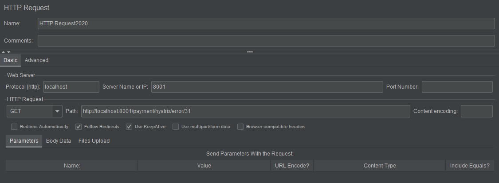
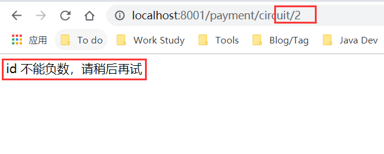
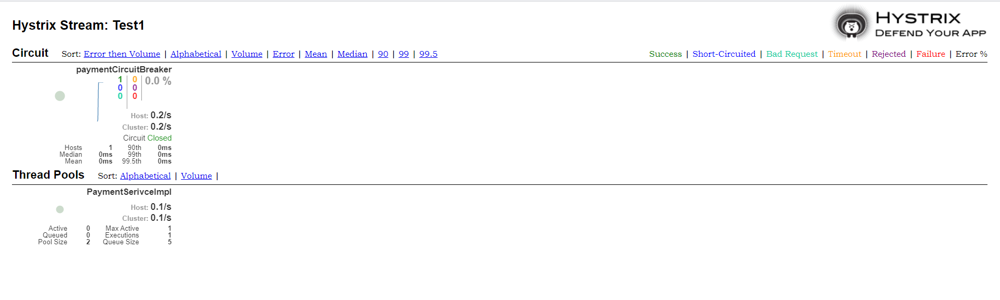
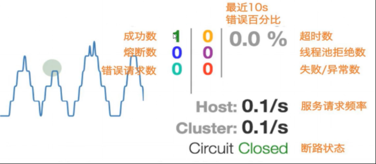
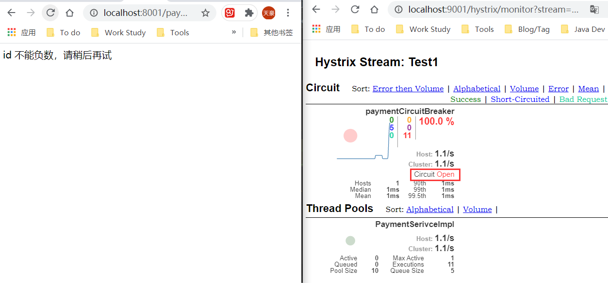

## 服务雪崩
在多个微服务的系统中，假设有ABC三个服务，并且A服务中调用了B服务，B服务中调用了C服务，组成了一个链路，而如果这个链路中的某个服务调用响应时间长或者不可用，对A的调用就会占用越来越多的系统资源，进而会造成系统崩溃。这就是所谓的雪崩。        
## Hystrix
所以需要一个能够对故障和延迟进行隔离和管理，以便于单个依赖关系的失败，不会拖垮整个系统的工具。Hystrix由此诞生，它是一个用于处理分布式系统的延迟和容错的开源库，在分布式系统中，许多依赖会因为各种原因导致调用超时或者调用失败，Hystrix能够保证一个依赖出问题的情况下，不会导致整体服务出现失败，避免级联故障。
## 服务熔断
服务熔断可以看做是家庭用的保险丝，当某个服务出现不可用或者响应超时的情况下，暂停对这个服务的调用。
## 服务降级
服务降级是从整个系统的负荷情况出发和考虑的，对于某些负荷比较高的情况，为了预防某个业务出现负荷过载或者响应慢的情况，在其内部暂时舍弃会一些非核心的接口或者数据的请求，而是直接返回一个提前准备好的FallBack错误处理信息，用来保证整个系统的稳定性和可用性。      
## 使用Hystrix实现服务降级
### 接口占用服务器资源的情况
这里先不将Hystrix引入工程，而是测试一下同一个服务中一个接口访问量激增导致另一个接口访问变慢的情况。这里参考尚硅谷的教程，分为一个支付模块，一个订单模块，案例中是订单模块调用支付模块。
### 创建一个不带Hystrix的支付模块
服务中主要是两个方法，一个是正常的方法，功能很简单，就是返回一个字符串，一个是异常测试方法，也是返回一个字符串，不同的是，里面进行睡眠3秒。如下。
```
@Service
public class PaymentHystrixServiceImpl implements PaymentHystrixService{


    @Override
    public String paymentOk(Integer id) {
        return "Normal method -- "+id;
    }

    @Override
    public String paymentError(Integer id) { 
        try {
            TimeUnit.SECONDS.sleep(3);
        }catch (InterruptedException e){
            e.printStackTrace();
        }
        return "Error method -- "+id;
    }
}

```
Controller层也很简单，创建两个接口来调用这两个方法。
```
@Controller
public class PaymentHystrixController {

    @Resource
    private PaymentHystrixService paymentHystrixService;
    
    @RequestMapping("/payment/hystrix/ok/{id}")
    @ResponseBody
    public String paymentOk(@PathVariable("id")Integer id){
        return paymentHystrixService.paymentOk(id);
    }
    @RequestMapping("/payment/hystrix/error/{id}")
    @ResponseBody
    public String paymentError(@PathVariable("id")Integer id){
        return paymentHystrixService.paymentError(id);
    }
}
```
可以看出，对于异常方法，会出现等待情况，而正常方法应该是立即返回的。现在对异常方法进行压力测试，这里用到Apache JMeter工具。
     
然而事实上测试可以发现，尽管只是对异常方法进行压力测试，但是正常方法调用还是会出现一定程度的延迟。这就是因为异常方法占用了服务器资源（在这里是Tomcat线程池中的工作线程已经被占用完毕），导致其他请求也变慢了。
### 服务降级配置
#### pom中加入Hystrix的依赖
```
        <dependency>
            <groupId>org.springframework.cloud</groupId>
            <artifactId>spring-cloud-starter-netflix-hystrix</artifactId>
        </dependency>
```
#### 主启动类配置断路器注解
```
@SpringBootApplication
@EnableEurekaClient
@EnableCircuitBreaker
public class PaymentMain8001 {
    public static void main(String[] args){
        SpringApplication.run(PaymentMain8001.class,args);
    }
}
```
#### 配置Fallback方法
在超时的方法上设置如下，需要注意的是，fallbackMethod字段对应的方法名和参数列表必须指定的Fallback方法的一致。
```
@Service
public class PaymentHystrixServiceImpl implements PaymentHystrixService{

    @Override
    public String paymentOk(Integer id) {
        return "Normal method -- ok";
    }

    @Override
    @HystrixCommand(fallbackMethod = "paymentErrorHandler",commandProperties =
            {@HystrixProperty(name="execution.isolation.thread.timeoutInMilliseconds",value = "3000")})
    public String paymentError(Integer id) {

        try {
            TimeUnit.SECONDS.sleep(5);
        }catch (InterruptedException e){
            e.printStackTrace();
        }

        return "Error method -- error";
    }

    public String paymentErrorHandler(Integer id){
        return "Fallback method -- error";
    }
}
```
当再次访问异常接口时，因为Hystrix配置的超时时间是3秒，而方法中睡眠了5秒，所以自然就要执行到Fallback方法。另外值得一提的是，不光是超时，如果是方法里的抛异常，比如**int a = 15/0**，也会执行这个方法。这里测试的是服务端的降级，其实在客户端也可以配置，并且一般来说，这个配置是放在客户端的。
### 客户端配置降级
由于客户端需要调用支付模块，所以需要加入OpenFeign的依赖，其次就是配置OpenFeign和Eureka。            
```
        <!-- openfeign -->
        <dependency>
            <groupId>org.springframework.cloud</groupId>
            <artifactId>spring-cloud-starter-openfeign</artifactId>
        </dependency>
        <dependency>
            <groupId>org.springframework.cloud</groupId>
            <artifactId>spring-cloud-starter-netflix-hystrix</artifactId>
        </dependency>
        <!--eureka client-->
        <dependency>
            <groupId>org.springframework.cloud</groupId>
            <artifactId>spring-cloud-starter-netflix-eureka-client</artifactId>
        </dependency>
```
之后就是Application.yml的配置了。
```
server:
  port: 80
eureka:
  client:
    register-with-eureka: false
    service-url:
      defaultZone: http://localhost:7001/eureka
feign:
  hystrix:
  # 开启降级保护
    enabled: true
```
接下来写Service层，但是由上面的支付模块的例子可以看出，Fallback方法和业务方法耦合在同一个类里面，所以在这里可以稍微对代码进行一下优化。那就是用一个专门的类来设置降级方法，这个选项可以在@OpenFeignClient里配置。如下：
```
@Component
@FeignClient(value  = "CLOUD-PROVIDER-HYSTRIX-PAYMENT",fallback = PaymentFallbackService.class)
public interface PaymentHystrixService {
    @GetMapping("/payment/hystrix/ok/{id}")
    public String paymentOk(@PathVariable("id")Integer id);
    @GetMapping("/payment/hystrix/error/{id}")
    public String paymentError(@PathVariable("id")Integer id);
}
```
PaymentFallbackService就是这个类，这个类是继承于PaymentHystrixService的。
```
@Component
public class PaymentFallbackService implements PaymentHystrixService{
    @Override
    public String paymentOk(Integer id) {
        return "Fallback_ok";
    }

    @Override
    public String paymentError(Integer id) {
        return "Fallback_error";
    }
}
```
在这之后就是控制层，控制层比较简单。
```
@RestController
public class OrderHystrixController {
    @Resource
    private PaymentHystrixService service;
    @GetMapping("/consumer/payment/hystrix/ok/{id}")
    public String paymentOk(@PathVariable("id")Integer id){
        return service.paymentOk(id);
    }
    @GetMapping("/consumer/payment/hystrix/error/{id}")
    public String paymentError(@PathVariable("id")Integer id){
        return service.paymentError(id);
    }

}
```
再进行测试，可以发现执行的降级方法就是PaymentFallbackService中的方法。并且，就算支付模块是关闭状态，依旧可以执行。
## 服务熔断
服务熔断就是在达到最大访问量的时候，直接拒绝访问，调用服务降级的方法并返回友好提示。当服务正常响应的时候，恢复链路。            
### 熔断配置
在Service类中添加熔断方法，添加熔断配置的注解。
```
//服务熔断
    @HystrixCommand(fallbackMethod = "paymentCircuitBreakerFallback",commandProperties = {
            @HystrixProperty(name = "circuitBreaker.enabled",value = "true"),//是否开启断路器
            @HystrixProperty(name = "circuitBreaker.requestVolumeThreshold",value = "10"),//请求次数
            @HystrixProperty(name = "circuitBreaker.sleepWindowInMilliseconds",value = "1000"),//时间窗口期
            @HystrixProperty(name = "circuitBreaker.errorThresholdPercentage",value = "60")//失败率达到多少后跳闸
    })
    public String paymentCircuitBreaker(@PathVariable("id")Integer id){
        if (id<0){
            throw new RuntimeException("id 不能为负数");
        }
        String serialNumber = IdUtil.simpleUUID();
        return Thread.currentThread().getName()+"调用成功，流水号:"+serialNumber;
    }
    public String paymentCircuitBreakerFallback(@PathVariable("id")Integer id){
        return "id 不能负数，请稍后再试";
    }
```
熔断器的打开和关闭，是按照如下步骤来决定的。
```
  	1,并发此时是否达到我们指定的阈值
  	2,错误百分比,比如我们配置了60%,那么如果并发请求中,10次有6次是失败的,就开启断路器
  	3,上面的条件符合,断路器改变状态为open(开启)
  	4,这个服务的断路器开启,所有请求无法访问
  	5,在我们的时间窗口期,期间,尝试让一些请求通过(半开状态),如果请求还是失败,证明断路器还是开启状态,服务没有恢复
  		如果请求成功了,证明服务已经恢复,断路器状态变为close关闭状态
```
现在来测试该方法，可以发现，在我们疯狂往接口塞为负数的ID之后，然后停止换成正数之后，发现正数也不正常了，这表示熔断器起作用了。

### 熔断整体流程
```
1请求进来,首先查询缓存,如果缓存有,直接返回,如果缓存没有,-->2
2,查看断路器是否开启,如果开启的,Hystrix直接将请求转发到降级返回,然后返回。如果断路器是关闭的,判断线程池等资源是否已经满了,如果已经满了，也会走降级方法。如果资源没有满,判断我们使用的什么类型的Hystrix,决定调用构造方法还是run方法，然后处理请求，然后Hystrix将本次请求的结果信息汇报给断路器,因为断路器此时可能是开启的(因为断路器开启也是可以接收请求的)断路器收到信息,判断是否符合开启或关闭断路器的条件,如果本次请求处理失败,又会进入降级方法
如果处理成功,判断处理是否超时,如果超时了,也进入降级方法
最后,没有超时,则本次请求处理成功,将结果返回给controller层。
```
## Hystrix服务监控--HystrixDashBoard
还是老套路，引入依赖。
```
        <dependency>
            <groupId>org.springframework.cloud</groupId>
            <artifactId>spring-cloud-starter-netflix-hystrix-dashboard</artifactId>
        </dependency>
```
yml中配置端口即可。然后主启动类需要加上@EnableHystrixDashboard，这里需要注意一点就是每一个被监控的服务都必须加入actuator依赖。
```
        <!--监控-->
        <dependency>
            <groupId>org.springframework.boot</groupId>
            <artifactId>spring-boot-starter-actuator</artifactId>
        </dependency>
```
此外，还需要在被监控服务中加入如下代码，原因注释中有所说明。
```
 /**
     * 为了服务监控来配置,与服务容器本身无关，而是SpringCloud升级后的坑。
     * ServletRegistrationBean因为Springboot的默认路径不是/hystrix.stream
     * 所以只要在自己的项目中配置下面的Servlet就行。
     * */
    @Bean
    public ServletRegistrationBean getServlet(){
        HystrixMetricsStreamServlet servlet = new HystrixMetricsStreamServlet();
        ServletRegistrationBean registrationBean = new ServletRegistrationBean(servlet);
        registrationBean.setLoadOnStartup(1);
        registrationBean.addUrlMappings("/hystrix.stream");
        registrationBean.setName("HystrixMetricsStreamServlet");
        return registrationBean;
    }
```
然后启动被监控服务，将其url加入到HystrixDashboard中。比如这里是8001端口，那么url就是http://localhost:8001/hystrix.stream。开启监控。

曲线表示流量变化。其他元素意义如下图所示。


### 测试HystrixDashboard
还是跟之前一样，疯狂网接口塞负数，然后观察Dashboard的变化。可以发现，到了一定程度，接口就有绿色close状态变为红色open状态。

### 相关资料
[跟着尚硅谷的视频学的，当做入门个人觉得还不错(不是打广告)](https://www.bilibili.com/video/BV18E411x7eT/?p=54)