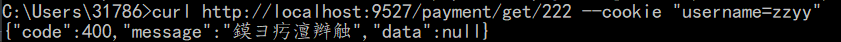
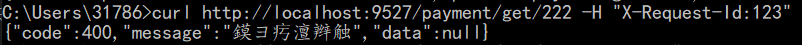
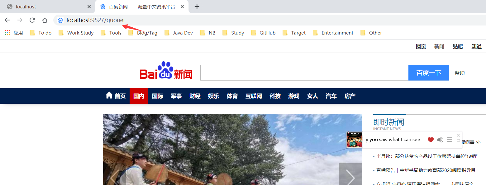
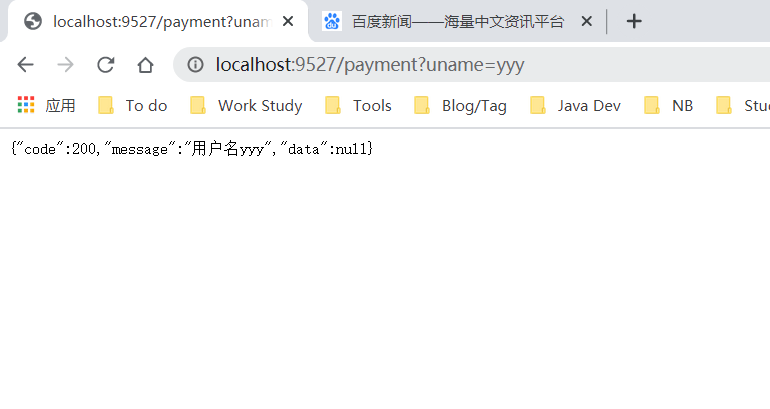
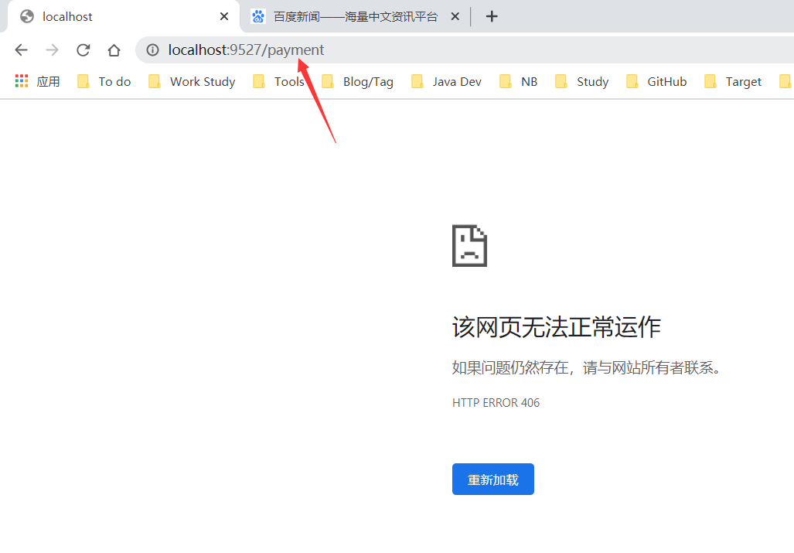

<!--
 * @Author: Yintianhao
 * @Date: 2020-07-28 21:53:09
 * @LastEditTime: 2020-07-28 22:46:25
 * @LastEditors: Yintianhao
 * @Description: 
 * @FilePath: \TechNote\src\Blog\20200728-Gateway.md
 * @Copyright@Yintianhao
--> 
# Gateway
## Gateway和Zuul的理念差别
SpringCloud中集成的Zuul版本，采用的是Tomcat容器，使用的是传统的Servlet IO处理模型。即：
```
container启动的时候构造Servlet对象并调用Servlet.init()方法进行初始化。          container运行时接收请求，并为每一个请求分配一个线程(一般从线程池获取空闲线程)，然后调用service()。          container关闭时调用Servlet.destroy()销毁Servlet。
```
这样的模式的缺点是，并发量高的情况下，大量的Servlet产生，从而绑定了大量的线程，而线程的资源实际上是很昂贵的，上下文的切换和内存的消耗会导致请求的处理时间延长。             

而Gateway的底层使用的是netty和webflux，webflux是一个典型的非阻塞异步框架，核心是基于Reactor的相关API实现的，相对于传统的Web框架来说，可以运行在诸如netty，undertow及支持Servlet3.1的容器上。
## Gateway的三大核心概念
### 路由Route
Route是构建网关的基本模块，由ID，目标URI，一系列的断言和过滤器组成，如果断言为true则匹配这个路由。      
### 断言Predicate
参考的是java8中的java.util.function.Prediacate，开发人员可以匹配HTTP请求中的所有内容，如果请求和断言相匹配则进行路由。
### 过滤器Filter
指的是Spring框架中的GatewayFilter的实例，使用过滤器，可以在请求路由前或者之后对请求进行修改。
## Gateway工作流程
客户端向SpringCloudGateway发出请求，然后在Gateway Handler Mapping中找到与请求相匹配的路由，将其发送到Gateway Web Handler，Handler再通过制定的过滤器来将请求发送到我们实际的服务执行业务逻辑，然后返回。简单的老说，它相当于一个门卫，挡在我们的服务之前，在请求到达我们的服务的时候能够做一些前置的处理，对于客户来说背后的服务实际上是屏蔽的，与我们交互的是网关。
## GateWay的基本使用
插一句话，最近刚参加工作，深感比在学校的时候要操心的地方要多得多，留给自己学习的时间也远远没有学校多，只能趁周六周末来充电，实际上这个博客在上个月月底就已经起草，断断续续没写几个字，而且Gateway的基本的东西也没学完，所以一直拖到今天，今天也不打算把Gateway学个底朝天，只打算总结一下之前学的基本的东西，更多东西还是要去实际项目中用再能总结出来，就先这样吧。          
在写Gateway的模块之前，事实上肯定至少有一个服务和一个注册中心的，这里也不讲Eureka和那个无关紧要的服务了。
### 配置Gateway的依赖
```
    <dependencies>

        <!-- https://mvnrepository.com/artifact/junit/junit -->
        <dependency>
            <groupId>junit</groupId>
            <artifactId>junit</artifactId>
            <version>4.12</version>
            <scope>test</scope>
        </dependency>

        <dependency>
            <groupId>cn.izzer</groupId>
            <artifactId>cloud-api-common</artifactId>
            <version>1.0</version>
        </dependency>
        <!--gateway-->
        <dependency>
            <groupId>org.springframework.cloud</groupId>
            <artifactId>spring-cloud-starter-gateway</artifactId>
        </dependency>
        <!--eureka client-->
        <dependency>
            <groupId>org.springframework.cloud</groupId>
            <artifactId>spring-cloud-starter-netflix-eureka-client</artifactId>
        </dependency>
        <dependency>
            <groupId>org.projectlombok</groupId>
            <artifactId>lombok</artifactId>
            <optional>true</optional>
        </dependency>
        <dependency>
            <groupId>org.springframework.boot</groupId>
            <artifactId>spring-boot-starter-test</artifactId>
            <scope>test</scope>
        </dependency>
    </dependencies>
```
### yml配置
这里主要是通过配置文件来配置一些映射，还有定义注册中心地址什么的，之后还有通过代码来配置全局的过滤器等等。
```
server:
  port: 9527
spring:
  application:
    name: cloud-gateway
  cloud:
    gateway:
      discovery:
        locator:
          enabled: true #开启动态路由
      routes:
        - id: payment_routh1
          uri: http://localhost:8001
          predicates:
            - Path=/payment/get/** #配置路径映射
            #- After=2020-08-14T22:44:44.829+08:00[Asia/Shanghai] 主要检测时间
            #- Cookie=username,zzyy 检测cookie，可以用curl进行模拟
            #- Header=X-Request-Id,\d+ #请求头要有X-Request-Id属性并且值为整数的正则表达式
        - id: payment_routh2
          uri: http://localhost:8001
          predicates:
            - Path=/payment
eureka:
  instance:
    hostname: cloud-gateway-service
  client:
      register-with-eureka: true
      fetch-registry: true
      service-url:
        defaultZone: http://localhost:7001/eureka
```
上面是配置了路径映射，发起请求的时间拦截，cookie等等，时间的设置需要调用ZoneDateTime来得到。如下：
```
    @Test
    public void timeZoneTest(){
        ZonedDateTime time = ZonedDateTime.now();
        System.out.println(time);
    }
```
这里演示一下Cookie和Header的测试，因为这里用到curl，我很少用这个东西，都是用postman，今天来涨涨知识。

然后是测试Header(乱码了......)

官网上还有许多相类似的配置，就不一一展示了，也没多大意义。接下来是用代码实现路由配置。主要用到的是RouteLocatorBuilder.Builder。用@Configuration加上注解即可。
```
@Configuration
public class GateWayConfig {
    @Bean
    public RouteLocator customRouteLocator(RouteLocatorBuilder routeLocatorBuilder){
        //这里是将网关服务的/guonei映射到百度新闻的国内新闻版块。
        RouteLocatorBuilder.Builder builder = routeLocatorBuilder.routes();
        builder.route("path_route_atguigu",r->r.path("/guonei").uri("http://news.baidu.com/guonei"));
        return builder.build();
    }
}
```
测试效果：

### Filter组件
物如其名，做过滤用的，这里演示一下全局判断接口传入的字段(在实际工作这个不要乱用)。主要是要实现GlobalFilter和Ordered接口，然后在里面加上自己的业务逻辑。我这里简单判断一下uname字段是否传入。
```
@Component
@Slf4j
public class GlobalGatewayFilter implements GlobalFilter,Ordered {
    @Override
    public Mono<Void> filter(ServerWebExchange exchange, GatewayFilterChain chain) {
        log.info("------- come into global filter------");
        String uname = exchange.getRequest().getQueryParams().getFirst("uname");
        if (uname == null){
            log.info("---------uname is null ----- ");
            exchange.getResponse().setStatusCode(HttpStatus.NOT_ACCEPTABLE);
            return exchange.getResponse().setComplete();
        }
        return chain.filter(exchange);
    }
    @Override
    public int getOrder() {
        return 0;
    }
}
```
传入uname的情况：

没有传入的情况：

