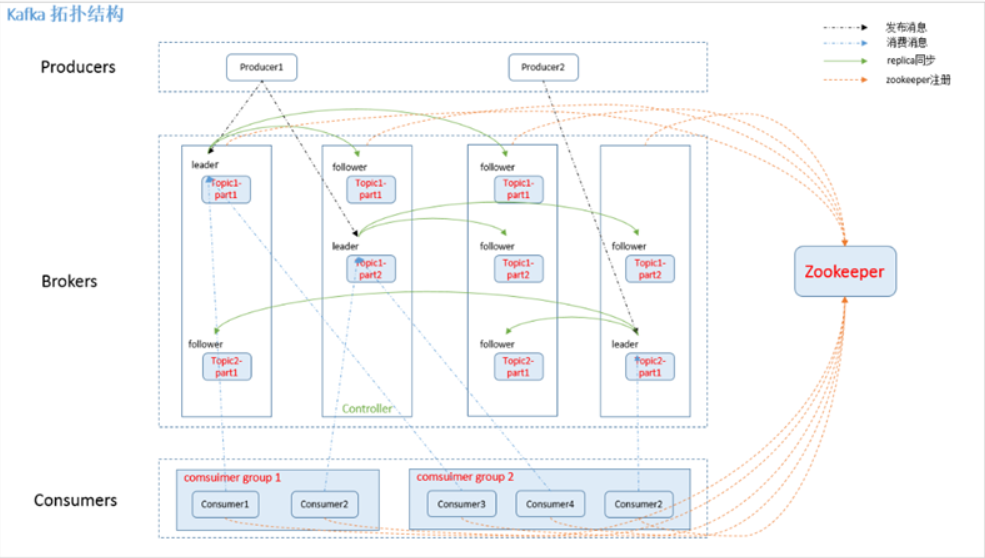

## Kafka的架构

一个Kafka集群中包含多个Producer，Producer可以是日志，系统CPU，Memory等，包含若干个Broker，若干个ConsumerGroup，以及一个Zookeeper集群，Kafka通过Zookeeper管理集群配置，选举Leader，以及在ConsumerGroup发生变化的时候进行Rebalance。Producer采取Push模式将消息发布到Broker，Consumer采取Poll模式从Broker里订阅并消费消息。
## Topic
Topic在逻辑上可以被认为是一个Queue，每条消费必须指定Topic意思就是指定这个消息放在哪个Queue里面，同时在kafka里面，为了使得吞吐率提高，物理上将Topic分成了多个Partition，每个Partition在物理上对应一个文件夹，该文件夹下存储这个Partition的所有消息和索引文件，创建一个Topic的时候，可以指定分区数目，分区的数目越多，其吞吐量也就越大，但是需要的资源也越多，同时也会增加不可用的风险，kafka在接收到生产者发送的消息之后，会根据均衡策略将消息存储在不同的分区当中，因为每条信息都被追加到这个partition中，属于顺序写磁盘，因为效率非常高。（区别顺序写和随机写）。
### 旧数据删除策略
kafka集群会保留所有的消息，无论这个消息是否被消费，但是事实上在现实中因为资源的问题，不可能永久保留所有数据，所以kafka有相应的删除策略。一种是基于时间，第二种是基于Partition的文件大小。策略选择需要结合业务实际情况。
## Producer消息路由
Producer发送信息到Broker的时候，会根据Partition机制选择将其存储到哪个Partition，如果Partition机制设置合理，所有消息可以均匀分布在不同的Partition里面，即实现了负载均衡，如果一个topic对应一个文件，那么这个文件所在的机器IO将会成为整个Topic的性能瓶颈，而有了Partition之后，不同的消息可以并行地写到不同Broker的不同Partition里，提高了吞吐率。这一点可以通过配置项来指定新建Topic的默认Partition的数量，也可以在创建Topic的时候通过参数来指定。

而在发送一条消息时候，可以指定此消息的key，Producer通过这个Key和Partition机制来判断应该将这条信息发送到哪个Partition。Partition机制可以通过指定Producer的Partition.class参数来指定，该Class实现了kafka.producer.Partitioner接口。
## ConsumerGroup
同一个Topic的一条消息只能被同一个ConsumerGroup中的一个Consumer消费，但多个ConsumerGroup可以同时消费一条消息。

这就是kafka来实现一个Topic消息的广播(发给所有的Consumer)和单播(发送给某一个Consumer)的手段，一个Topic可以对应多个ConsumerGroup。如果需要实现广播，那么只要一个Consumer有一个独立的Group就行了。要实现单播只要所有的Consumer在同一个Group里，用ConsumerGroup还可以将Consumer进行自由的分组而不需要多次发送消息到不同的Topic。
## Kafka delivery guarantee
```
at most once 消息可能会丢，但是绝对不会重复传输
at least one 消息绝对不会丢失，但是可能会重复传输(默认)
exactly onece 每条消息肯定只会被传输一次且只传输一次
```
kafka默认保证At least once，并且允许通过设置Producer异步提交来实现At most once，而exactly once要与外部存储相互协作。

## Replication
在kafka0.8以前的版本中，是没有
replication的，这就导致一旦一个Broker宕机，那么其他所有的partition数据都不可用被消费，同时生产者也不能将消息存入到这些partition中。         
如果生产者使用同步模式则生产者会尝试重新发送message.send.max.retries次后抛出异常，用户可以选择停止发送后续数据也可以继续发送数据，停止发送会造成数据阻塞，继续发送会导致整个Broker的数据丢失。      
如果生产者使用异步模式，那么生产者会尝试重新发送message.send.max.retries后记录该异常并且继续发送数据，这样会造成数据丢失并且用户只能通过日志才能发现问题，因为kafka的生产者并没有对异步模式提高回调。           
所以没有replication的情况下，一旦机器宕机或者某个Broker停止工作，会造成整个系统的可用性降低。           
## 选举Leader
有了replication之后，同一个partition可能会有多个replication，这时候就需要在这些replication中选举出leader，消费者生产者只与leader交互，其他replication作为follower从leader当中复制数据。这样做的目的是因为，如果不设置一个leader，那么为了确保多个replication中能够同步数据，就必须需要保证多个replication能够互相同步数据，假设replication有N个，那么就有N*N个通路，数据一致性很难保证，而有了leader之后，只需要从leader中同步数据即可，相当于N条通路，简单高效。           
## Kafka 高可用设计
### 将所有replication均匀分布到集群
分配算法：      
1，将所有broker和待分配的partition排序      
2，将第i个partition分配到第(i%n)个broker上      
3，将第i个partition的第j个replication分配到第(i+j)%n个broker上。
### 副本策略
也就是上面replication策略。
#### 消息传递同步策略
生产者在发布消息到某个partition中的时候，先通过Zookeeper找到这个partition的leader，将该信息发送给这个leader，leader会将信息写入日志。每个follower都从leader拉数据，这种方式下，follower存储的数据和leader是一致的。follower在收到信息也写入日志，并且向leader发送ACK消息，一旦leader把所有的replication的ACK都收到了，说明消息已经被commit了。随之leader会向生产者发送ACK信息。     
为了性能，上面的描述中，其实每个follower在接收到数据之后会立马发送ACK到leader，而不是等待写入日志，对于已经commit的消息，kafka只能保证它被存到多个replication的内存中，而不保证持久化，当然，也不能保证异常发生后这个消息一定会被消费者消费。但是只有commit的消息才会暴露给消费者。
#### ACK前的备份
判断一个Broker是否存活，一是broker必须维护其和Zookeeper的session，说到代码上就是心跳机制。二是follower必须能够及时地将leader的消息复制过来。            
leader会跟踪它的follower列表，如果其中一个宕机或者落后太多，那么会将它从列表中移除，kafka的复制机制并不是完全的同步复制和异步复制，因为完全同步会影响吞吐率，而异步的情况下，数据只要被写入日志就会被认为已经commit，这种情况下，如果follower都复制完都落后于leader，那么如果leader突然挂了，就会造成数据丢失。采用列表的方式就可以很好的均衡了确保数据不丢失以及吞吐率，follower可以批量的从leader复制数据，提高复制性能，减少leader和follower的差距。
### leader的选举算法
选举机制具体来讲是一个分布式锁，有两种方式实现基于Zookeeper的分布式锁：         
```
节点名称的唯一性：即多个客户端创建一个节点，只有成功创建节点的客户端才能获得锁。
临时顺序节点：所有客户端在某个目录下创建自己的临时顺序节点，只有序号小的才能获得锁。
```