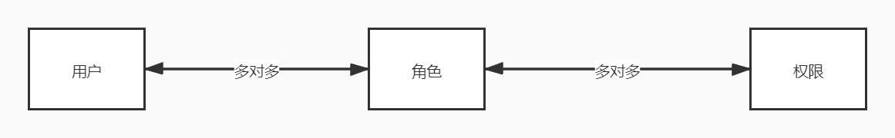

## 权限系统模型

### 前言

权限管理一直是后台系统中一个比较重要的东西，因为一般会涉及到安全方面的问题。之前在公司老的授权系统上做了一个模块的改造，算是体验了一下授权系统是怎么回事，但自己经验不够，也没去了解基本模型，所以出去面试也被怼了，这里补一下权限系统的基本模型，然后了解一下业界的常用权限框架。

### RBAC0

RBAC是最为普及的权限设计模型，全称是Role-Based Access Control。这里介绍的是最核心的模型，RBAC0，那么这个模型分为哪几个部分呢？

上面就是RBAC0的模型图了，他们之间都是多对多的关系，这个好理解。接下来阐述一下这其中的三个部分。

- 用户

  用户就是操作的主体，可以这个系统的管理员，也可以使C端用户，也可以内部员工，即可以简单分为2B和2C用户。

- 角色

  角色其实也好理解，比如一个系统有管理员和普通用户两种角色，管理员和普通用户自然有着不同的权限。它是权限和用户之间的桥梁，可以避免直接对用户进行赋权操作，而是对用户赋予某个角色，那么这个用户就有了这个角色下的所有权限，这样方便之后拓展并且提交效率。每一个角色可以关联多个权限，而一个用户可以关联多个角色，所以这样一个用户就有了多个角色的多个权限。

- 权限

  权限就是用户可以访问的资源，具体可以分为页面权限，操作权限和数据权限。

  - 页面权限，这个好理解，就是用户登录系统可以看到的页面。
  - 操作权限，也就是包括增删改查审批这样的操作权限。
  - 数据权限，就是不同用户在同一个界面看到的数据可能是不同的。

### RBAC1

前面一般称之为RBAC0模型，RBAC1是在这个基础上扩展来的，增加了角色的继承概念，也就是角色这这里具有了上下级的关系，谈到继承，那么自然就有继承关系的区分，RBAC1角色的继承关系分为一般继承关系和受限继承关系，一般继承管理允许角色之间多继承，而受限继承关系进一步要求角色继承关系必须是一个树形结构。有了继承，那么比如A继承了B，那么A就自动有了B的权限，所以赋予给用户的时候，就不需要再两个都赋予一遍了。

### RBAC2

RBAC2在用户与角色之间和角色与角色之间做了一些约束，规定了权限被赋予角色的时候，或者角色被赋予用户的时候，以及用户主动激活一个角色的时候，必须遵循一些强制性的规则。具体可以包括为：

- 互斥角色

  同一个用户只能被分为到一个互斥用户集合中的至多一个角色，支持责任分离的原则。互斥角色就是权限互相制约的角色，跟概率论里的互斥差不多意思。

- 基数约束

  一个角色被分配的用户数量受限，一个角色可以拥有的角色数目受限，一个角色对应的访问权限数目也受限。

- 先决条件角色

  即用户想获得某上级角色，必须先获得下一级的角色。

### 用户组和权限组

- 用户组

  当用户基数变大的时候，角色类型增多的时候，一般有一部分人就有了相同的属性，比如某一个部分中的所有员工，如果直接给某个用户分配角色，那么工作量会很大，那么如果把相同属性归到某一个用户组，那么直接将用户添加到某个用户组下，这个用户就有了和组里其他人一样的权限了。

- 权限组

  权限组就是将多个权限打包，比如某一个产品的所有模块的使用权限，在赋予权限的时候，就直接按权限组来赋予。

### 授权流程

授权就是给用户授予角色，这个过程可以分为手动授权和审批授权。

- 手动授权

  管理员来进行操作，给用户添加角色，给角色添加用户。

- 审批授权

  这个是用户来申请某一个职位角色，然后管理员或者对应的上级进行审批。

### 常用权限框架

- Apache shiro

  shiro是一个开源项目，也是一个轻量级框架，Spring生态里有Spring security，但比shiro要复杂一点，这里鉴于篇幅，Spring Security我之后再重新写一个吧。

  shiro包括三个重要的功能模块，分别是：

  - Subject，即主体，一般指用户。
  - SecurityManager，安全管理器，管理所有的主体，可以配合内部安全组件。
  - Realms，用于进行权限信息的验证，这里需要自己写代码。

  shiro的功能有很多，包括：身份认证，授权，会话管理，加密，web支持，缓存，多线程并发认证，测试支持，Run As，Remember me等。

- Spring Security

  这个比Shiro要复杂一点，它和SpringMVC有很好的集成，并配置了流行的安全算法实现，安全主要包括认证和验证，认证是为用户建立一个其声明的角色的过程，这个角色可以是一个用户，一个设备或者一个系统，验证指的是一个用户在应用中能够执行某个操作。

  它可以分为：

  - Web/http 安全，通过一系列过滤器来实现框架的认证机制，访问受限制的url的时候将用户引导到错误界面或者登陆界面。
  - AuthenticationManager 处理来自于框架其他部分的认证请求。
  - AccessDecisionManager，为web或者方法提供访问决策，会注册一个默认的，我们也可以通过普通bean注册的方式使用自定义。
  - AuthenticationProvider，通过它来认证用户。
  - UserDetailsService，跟AuthenticationProvider相关，用来获取用户信息。

- 两者比较

  -  shiro更容易使用，实现和理解。Spring Security相比之下更加复杂。
  - SpringSecurity在社区上更胜一筹，并且对Spring生态有很好的支持，但从这方面看shiro其实也有好处，那就是不和其他框架绑定。

