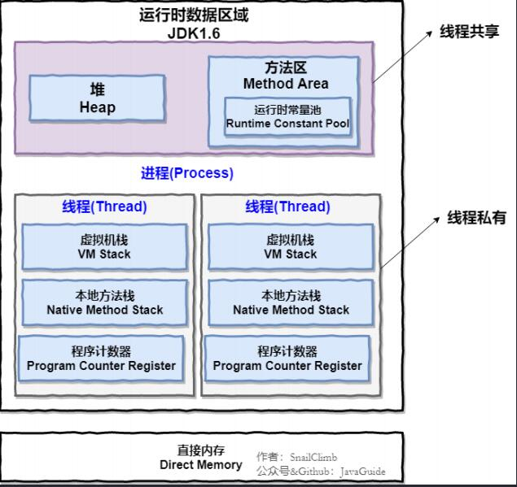
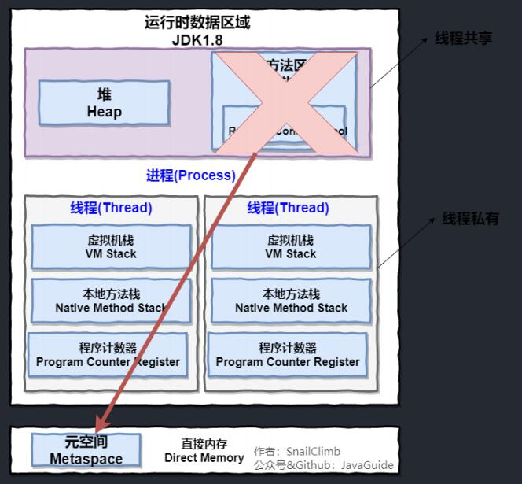
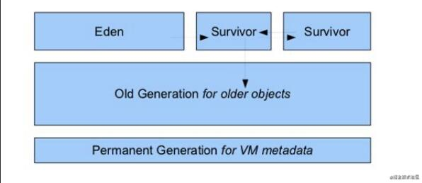
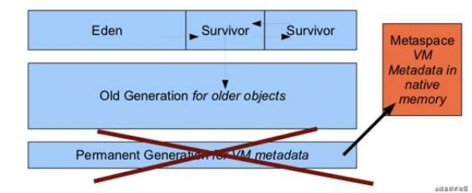

## 运行时数据区

### 1.8及以前的区别

1.8之前：

1.8：

### 分别概述

- 方法区

  作用：存储已经被虚拟机加载的类信息，常量，静态变量，方法字节码.class文件中的内容。  
  GC在这里的动作：常量池回收，类型的卸载。

- 堆

  作用：1，此内存区域存在的唯一目的是存储对象实例，几乎所有的对象实例都在这里分配。         
  2，垃圾回收的主要场所。

  - 1.7及以前

    

  - 1.8

    

- VM Stack

  主要保存局部变量，基本数据类型变量和堆内存中某个对象的引用变量。    

  基本单位：栈帧，每个方法执行的时候都会在此处创建一个栈帧，用来存储局部变量表，操作数栈，方法出口(返回地址)等信息。 随着每个方法的执行，栈帧会进行入栈和出栈操作。     
  局部变量表：实际上是一个栈结构，存放了编译器可知的各种基本数据类型，对象引用，returnAddress类型(指向一条字节码指令地址)。      对象引用可能指向一个对象的起始地址，也可可能是指向一个代表对象的句柄或者其他与此对象相关的位置。

  常见的两种异常：          
  1，StackOverflow 创建的栈帧数超过了虚拟机固定的栈深度。         
  2，OutOfMemoryError 虚拟机可申请的内存空间不足。             

- Native Stack

  作用:和虚拟机栈一样，在执行本地方法存放本地局部变量            
  native接口：是Java提供的调用OS内核方法的接口，OS底层方法。在这个区域中也会出现Stack OverflowError和OutOfMemoryError错误。

- 程序计数器

  当前线程正在执行的字节码的行号指示器。         
  过程：字节码解释器JVM通过改变程序计数器的值来选取下一条执行的字节码指令，分支循环跳转异常处理线程恢复都依靠它。         
  特点：逻辑上的计数器，每条线程之间的计数器相互独立，对java方法计数，native为undefined       

  这也是内存区域在虚拟机规范中唯一一个没有规定任何oom的区域   