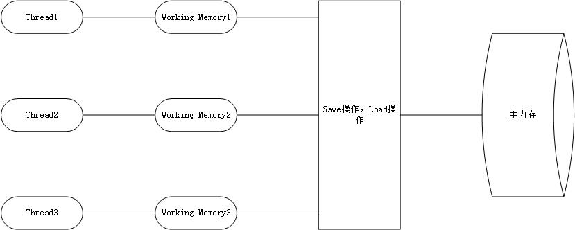

<!--
 * @Author: Yintianhao
 * @Date: 2020-05-03 00:00:58
 * @LastEditTime: 2020-05-03 16:34:36
 * @LastEditors: Yintianhao
 * @Description: 
 * @FilePath: \TechNote\src\Java\内存模型.md
 * @Copyright@Yintianhao
 -->
 ## 内存模型
 java内存模型是java虚拟机规范设计的，用来屏蔽各种硬件和操作系统的内存访问差异的，这样可以实现java程序在各种平台上都能达到一致的内存访问效果。       
 ### 主内存和工作内存
 jmm设计的主要目标是定义变量存储到内存和从内存中取出的底层细节。这里变量是实例字段，静态字段和构成数组对象的元素，是线程共享的变量，自然就不包括局部变量，方法参数等私有变量，因为他们不存在竞争。          
 #### 主内存(共享)
 jmm规定所有的变量都存储在主内存中，这里的主内存和物理硬件中的主内存是一个概念，但它只是虚拟机内存的一部分。
 #### 工作内存(私有)
 每一个线程都有自己的工作内存，当中保存了被这个线程使用到的变量的主内存副本的拷贝。线程对变量的操作都必须在工作内存中进行，而不是直接操作主内存。工作内存是jmm的一个概念，并不真实存在，它涵盖的是写缓冲区，缓存，寄存器和其他硬件和编译器层面的优化。          
                   

主内存对应于java堆中的对象实例，而工作内存对应虚拟机栈中的部分区域。回到硬件层来说，主内存直接对应于物理硬件的内存，而工作内存对应寄存器或者高速缓存。

### 重排序
为了提高性能，编译器和处理器会对指令进行重排序。而重排序分为三种：          
#### 1 编译器优化的重排序
编译在不改变单线程语义的前提下，可以重新安排语句的执行顺序。        
#### 2 指令集并行的重排序
现代处理器采用了指令集并行技术，将多个指令重叠执行，如果这些指令之间不存在数据依赖，那么处理器可以改变语句对应机器指令的执行顺序。          
#### 3 内存系统的重排序
因为处理器使用缓存和读写缓存区，这使得加载和存储操作看上去可能是乱序执行。

从java代码到最终实际执行的指令序列，会经过上面三种重排序。其中第一种属于编译器重排序，2，3属于处理器重排序。对于编译器，内存模型的编译器重排序规则会禁止特定类型的编译器重排序，对于处理器重排序，内存模型的处理器重排序规则会要求java编译器在生成指令序列时，插入特定类型的内存屏障指令，通过屏障来禁止特定类型的处理器重排序。            

### 处理器重排序
处理器使用写缓冲区来临时保存向内存写入的数据，可以保证指令流水线持续执行，可以避免处理器停顿下来等待向内存写入数据而产生的延迟。并且，通过对批处理的方式刷新写缓冲区和合并写缓冲区对同一内存多次写，可以减少对内存总线的使用。但是写缓冲区有一个坏处，那就是它只对所在的处理器可见，这个特点会对内存操作的执行顺序产生重要的影响，处理器对内存的读写操作的执行顺序不一定与内存的实际读写顺序一致。