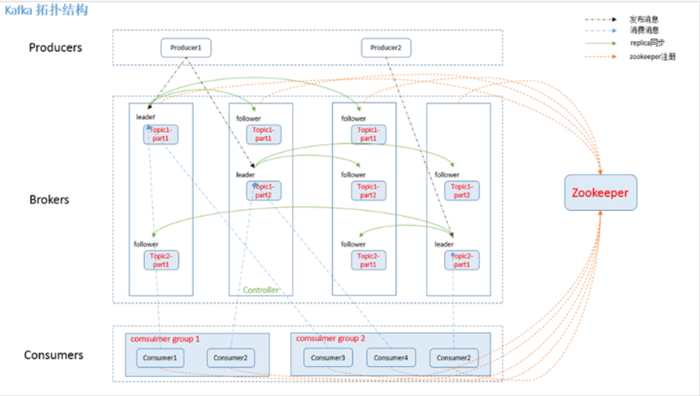

## Kafka的架构

一个Kafka集群中包含多个Producer，Producer可以是日志，系统CPU，Memory等，包含若干个Broker，若干个ConsumerGroup，以及一个Zookeeper集群，Kafka通过Zookeeper管理集群配置，选举Leader，以及在ConsumerGroup发生变化的时候进行Rebalance。Producer采取Push模式将消息发布到Broker，Consumer采取Poll模式从Broker里订阅并消费消息。
## Topic
Topic在逻辑上可以被认为是一个Queue，每条消费必须指定Topic意思就是指定这个消息放在哪个Queue里面，同时在kafka里面，为了使得吞吐率提高，物理上将Topic分成了多个Partition，每个Partition在物理上对应一个文件夹，该文件夹下存储这个Partition的所有消息和索引文件，创建一个Topic的时候，可以指定分区数目，分区的数目越多，其吞吐量也就越大，但是需要的资源也越多，同时也会增加不可用的风险，kafka在接收到生产者发送的消息之后，会根据均衡策略将消息存储在不同的分区当中，因为每条信息都被追加到这个partition中，属于顺序写磁盘，因为效率非常高。（区别顺序写和随机写）。
### 旧数据删除策略
kafka集群会保留所有的消息，无论这个消息是否被消费，但是事实上在现实中因为资源的问题，不可能永久保留所有数据，所以kafka有相应的删除策略。一种是基于时间，第二种是基于Partition的文件大小。策略选择需要结合业务实际情况。
## Producer消息路由
Producer发送信息到Broker的时候，会根据Partition机制选择将其存储到哪个Partition，如果Partition机制设置合理，所有消息可以均匀分布在不同的Partition里面，即实现了负载均衡，如果一个topic对应一个文件，那么这个文件所在的机器IO将会成为整个Topic的性能瓶颈，而有了Partition之后，不同的消息可以并行地写到不同Broker的不同Partition里，提高了吞吐率。这一点可以通过配置项来指定新建Topic的默认Partition的数量，也可以在创建Topic的时候通过参数来指定。

而在发送一条消息时候，可以指定此消息的key，Producer通过这个Key和Partition机制来判断应该将这条信息发送到哪个Partition。Partition机制可以通过指定Producer的Partition.class参数来指定，该Class实现了kafka.producer.Partitioner接口。
## ConsumerGroup
同一个Topic的一条消息只能被同一个ConsumerGroup中的一个Consumer消费，但多个ConsumerGroup可以同时消费一条消息。

这就是kafka来实现一个Topic消息的广播(发给所有的Consumer)和单播(发送给某一个Consumer)的手段，一个Topic可以对应多个ConsumerGroup。如果需要实现广播，那么只要一个Consumer有一个独立的Group就行了。要实现单播只要所有的Consumer在同一个Group里，用ConsumerGroup还可以将Consumer进行自由的分组而不需要多次发送消息到不同的Topic。
## Kafka delivery guarantee
```
at most once 消息可能会丢，但是绝对不会重复传输
at least one 消息绝对不会丢失，但是可能会重复传输(默认)
exactly onece 每条消息肯定只会被传输一次且只传输一次
```
kafka默认保证At least once，并且允许通过设置Producer异步提交来实现At most once，而exactly once要与外部存储相互协作。

