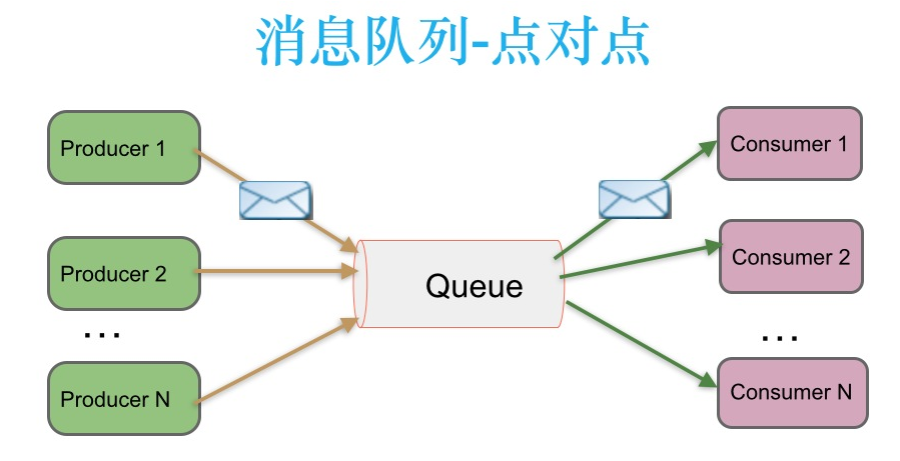
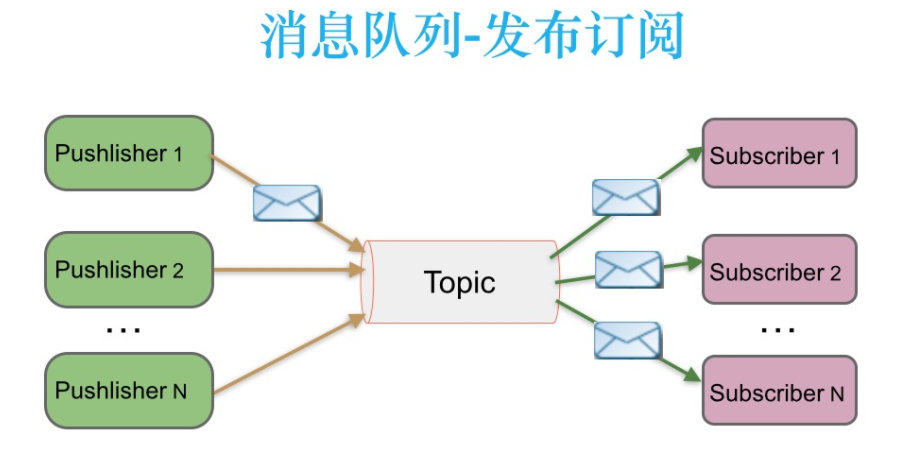
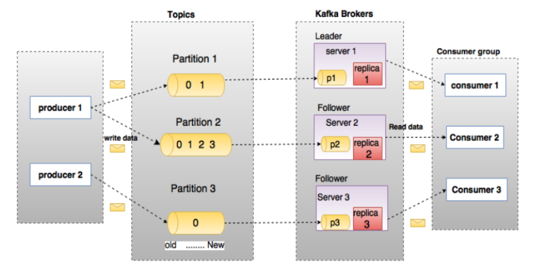

<!--
 * @Author: Yintianhao
 * @Date: 2020-08-30 17:47:22
 * @LastEditTime: 2020-08-30 18:38:03
 * @LastEditors: Yintianhao
 * @Description: 
 * @FilePath: \TechNote\src\Kafka\kafka介绍及入门.md
 * @Copyright@Yintianhao
-->
## 消息系统介绍
一个消息系统负责将数据从一个应用传递到另一个应用，应用只需要关注数据，无需关注数据在两个或者多个运用之间是如何传递的，分布式消息传递基于可靠的消息队列。
在客户端和消息系统之间异步传递消息，消息系统主要有两种消息传递模式，点对点，发布订阅模式，而kafka采用的就是发布订阅模式。

## 两种消息传递模式
### 点对点
在点对点消息系统中，消息持久化到一个队列中，此时将有一个或者多个消费者消息队列中的数据，但是只有一条消息只能被消费异常，当一个消费者消费了队列中的某条数据之后，该条数据将从消息队列中删除，该模式即使有多个消费者同时消费数据，也能保证数据处理的顺序。

### 发布订阅
在这个模式中，消息被持久化到一个Topic中，消费者可以同时订阅多个Topic，消费者可以消费该topic中所有的数据，同一条数据可以被多个消费者消费，数据消费后不会立马删除，在发布订阅消息系统中，消费的生产者称为发布者，消息者称为订阅者。

## Kafka介绍
kafka最初是由linkedin开发的，是一个分布式，分区的，多副本的，基于Zookeeper协调的分布式日志系统，当然它也可以当做消息队列来使用。
常见的可以用于Web，nginx日志，访问日志，消息服务等等。         
所以kafka的应用场景主要有：日志收集系统和消息系统。        
## 特点
### 解耦
消费者生产者之间不想相互耦合，只要都遵循同样的接口约束就行。
### 冗余(副本)
这里主要是为了保证数据不会丢失，许多消息队列采用"插入-获取-删除"的模式，在把一个消息从队列中年删除之前，需要系统明确指出这个消息已经被处理完毕，从而确保数据被安全地保存直到使用完毕。
### 扩展性
支持扩展
### 灵活性，峰值处理能力
在访问量剧增的情况下，使用消息队列能够使得关键组件顶住突然的访问压力，使得应用仍然需要继续发挥作用。
### 可恢复性
系统的一部分组件失效时，不会影响整个系统，即使一个处理消息的线程挂掉，加入队列中的消息也可以在系统恢复后被处理。
### 顺序保证
Kafka保证一个Partition中的消息的有序性。
### 缓冲
通过一个缓冲层来帮助任务最高效率地执行，写入队列的处理尽可能地传递。
### 异步通信
采用异步通信机制，允许先把消息放入队列，但并不立即处理，而是在需要的时候再去用它们。

## Kafka中的几个概念

### Broker
Kafka集群包括一个或者多个服务器，服务器节点称为broker。broker存储topic的数据，如果某个topic有N个partition，集群有N个broker，那么每个broker存储该topic的一个partition，如果某个topic有N个partition，集群有N+m个broker，那么N个broker存储该topic中的一个partition，剩下的m个broker不存储该topic的partition数据。如果某个topic的broker数量比partition的数量少，那么一个broker可能会存储多个该topic的partition。
在实际生产中应该尽量避免这种情况发生，因为很容易造成kafka集群数据不均衡。
### Topic
每条发布到kafka的集群消息都有一个类别，这个类别称为topic。
### Partition
Topic的数据分割为一个或者多个partition，每个partition中的数据使用过个segment文件存储。partition的数据是有序的，不同partition间的数据丢失了数据的顺序，如果topic有多个partition，消费数据就不能保证数据的顺序，在需要严格保证消息的消息顺序的场景下，需要将partition数目需要1。
### Producer
生产者
### Consumer
消费者
### Consumer Group
每个Consumer属于一个特定的ComsumerGroup，可为每个Consumer指定GroupName，不指定则为默认。
### Leader
每个Partition有多个副本，其中有且仅有一个Leader，即负责读写数据的Partition。
### Follower
Follower跟随Leader，所有的写请求都通过Leader路由，数据变更会广播到所有的Follower。如果Leader失效，那么Follower中会选举出一个新的Leader。