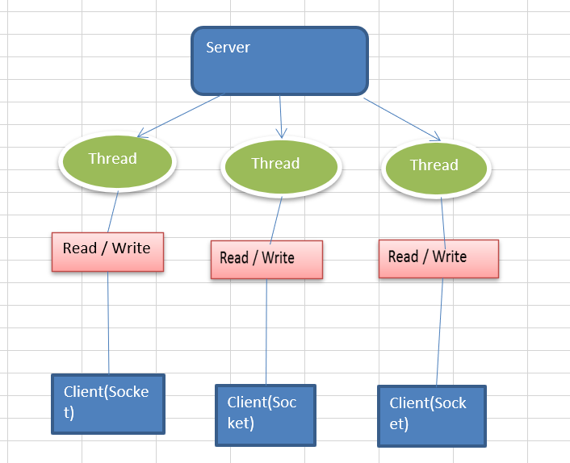
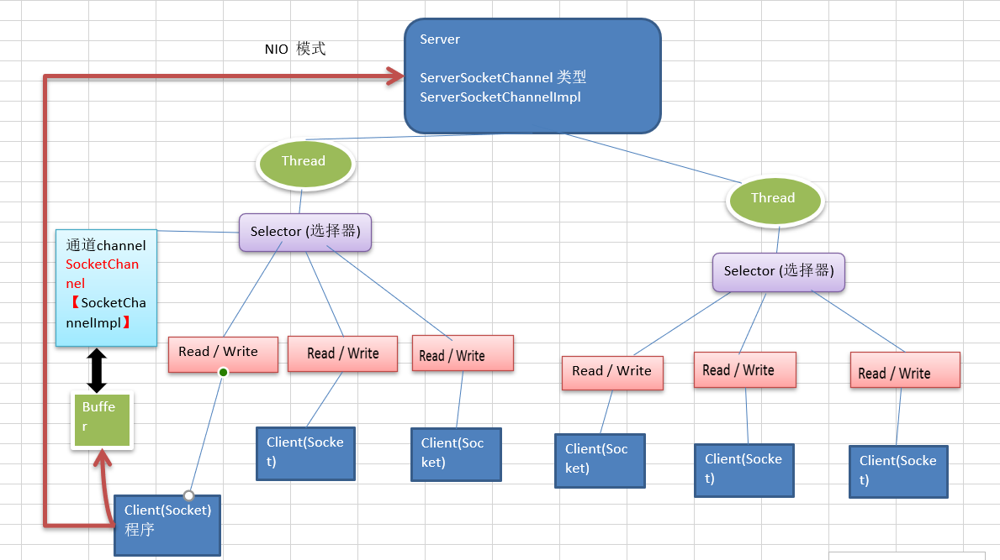
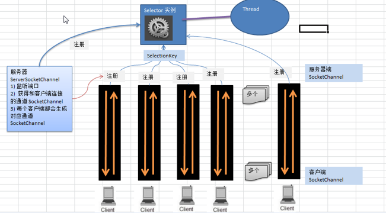

<!--
 * @Author: Yintianhao
 * @Date: 2020-07-09 17:26:05
 * @LastEditTime: 2020-07-12 00:51:38
 * @LastEditors: Yintianhao
 * @Description: 
 * @FilePath: \TechNote\src\Netty\IO模型.md
 * @Copyright@Yintianhao
--> 
## I/O模型
用什么样的通道进行数据的发送和接收，很大程度上决定了通信的性能。
### BIO(同步阻塞)，AIO(异步非阻塞)，NIO(同步非阻塞)
BIO：服务器实现方式为一个连接对应一个线程，如果线程不做任何事情会造成资源的浪费。简单容易理解，对服务器资源要求比较高。但是可以通过线程池来进行改善。                  

NIO：服务器实现方式为一个线程处理多个连接，即连接请求会注册到多路复用器上，复用器轮询到这个连接就进行处理。适用于连接数目多并且连接比较短的系统，比如IM服务器，弹幕，服务器间通讯等等。JDK1.4开始支持。         

AIO：引入异步通道的概念，采用Proactor模式，只有有效的请求才启动线程。(目前应用不多，插眼)适用于连接树木多并且连接比较长的系统，充分调用操作系统来进行并发操作。JDK7开始支持。       

## NIO
非阻塞模式，使得一个线程从某个通道发送请求或者读取数据，但是这个线程只能得到目前可用的数据，如果没有数据可以读的时候，就什么都不会获取，这个时候这个线程不会阻塞，直到有数据可以读之前，线程都可以继续做其他事情。同样的道理，写的时候也不需要等待完全写入，它可以继续做其他事情。          
```
//示例
public class NIOTest {
    private static Logger logger = Logger.getLogger(NIOTest.class);
    public static void main(String[] args){
        //可以存放五个整数的buffer
        IntBuffer intBuffer = IntBuffer.allocate(5);
        //存放数据
        intBuffer.put(1);
        intBuffer.put(2);
        intBuffer.put(3);
        intBuffer.put(4);
        intBuffer.put(5);
        //读取数据
        //1 flip将buffer进行读写切换
        intBuffer.flip();
        //2 读取
        while(intBuffer.hasRemaining()){
            logger.info(intBuffer.get());
        }
    }
}
```
### NIO三大组件 Selector，Channel，Buffer
           
一个Channel对应一个Buffer,一个Selector对应一个线程，对应多个Channel，切换到哪个Channel取决于事件(Event)。
### Buffer
本质是一个可以读写数据的内存块(数组)，可以理解为一个容器对象。API略。
### Channel
NIO通道类似于流，区别于流的地方在于Channel可以同时进行读写，而流只能写，同时Channel可以异步读写数据，和Buffer也能相互传递数据。         
### Selector
多个Channel可以以事件的方式注册到一个Selector上.Netty的NioEventLoop聚合了Selector，称为多路复用器。         

SelectionKey，根据SelectionKey可以得到相应的Channel。它之于Channel相当于Key-Value的关系。
### NIO非阻塞网络编程原理

1，当客户端连接时，会通过ServerSocketChannel得到SocketChannel。然后将SocketChannel通过Selector的register()注册到Selector上，注册成功后返回SelectionKey并将其放在Selector的内部集合中统一管理，Selector就可以进行监听(select方法，可以返回发生事件的通道个数)，从而得到这些发生了事件的通道的SelectionKey，通过SelectionKey就可以得到SocketChannel。通过Channel完成业务处理。

### SelectionKey
表示Selector和网络通道的注册关系。
```
OP_ACCEPT 新的连接可以建立 值16
OP_CONNECT 新的连接已经建立 值8
OP_READ 读 值1
OP_WRITE 写 值4
```
### 实现群聊
todo
### 零拷贝（从操作系统的角度来讲就是没有CPU拷贝）
所谓零拷贝就是在内核缓冲区之间没有数据是重复的，只有内核缓冲区一份数据。在java中，常用的零拷贝主要有mmap内存映射和sendFile。（操作系统知识待补充）
### mmap
主要是通过内存映射，将文件映射到内核缓冲区，同时用户空间可以共享内核空间的数据，这样，在进行网络传输的时候。可以减少内核空间到用户空间的拷贝次数。
### sendFile
sendFile是Linux中的函数，基本原理是数据不用经过用户态直接从内核缓冲区进入SocketBuffer，这个过程和用户态无关，所以减少了一次上下文切换。以上是2.1中的做法，在2.4版本中对此
做了优化，在这个版本中直接将数据拷贝到协议栈，从而减少了到SocketBuffer的一次拷贝。
## 两者区别
mmap适合小数据读写，sendFile适合大文件传输。mmap需要四次上下文切换，三次数据拷贝。sendFile需要三次上下文切换，最少两次数据拷贝。sendFile可以利用DMA方式减少CPU拷贝，mmap不能。
## 零拷贝案例
todo

### unix网络编程中的五种io模型

- 阻塞io
- 非阻塞id
- io多路复用
- 信号驱动io
- 异步io

#### Unix io基础

- 文件描述符 linux的内核将所有的外部设备都看做一个文件来操作，那么对一个文件的读写操作就会调用内核提供的系统命令，返回一个文件描述符，对一个socket的读写也会影响对应的描述符，称为socket fd，描述符就是一个数字，指向内核中的一个结构体。这个结构体中包含文件路径，数据区等属性。
- 用户空间和内核空间，为了保证用户进程不能直接操作内核，保证内核的安全，操作系统把虚拟空间分成了两个部分。
- io 运行过程，以读来说，应用程序调用系统提供的read接口，系统此时先等待数据准备，查看内核空间是否有数据，将数据从内核拷贝到进程中，将内核空间数据拷贝到用户空间。然后程序发现用户空间有数据了之后，进行读取。所以应用程序调用read的时候，是必须等待的。
- 阻塞io模型，在进程(用户)空间中调用`recvfrom`，其系统调用直到数据包到达且被复制到应用进程的缓冲区中或者发生错误时才返回**，在此期间**一直等待。
- 非阻塞io模型，`recvfrom`从应用层到内核的时候，如果没有数据就直接返回一个EWOULDBLOCK错误，一般都对非阻塞I/O模型进行轮询检查这个状态，看内核是不是有数据到来。

- io复用模型，调用select，poll，epoll，pselect其中一个函数，传入多个文件描述符，如果有一个文件描述符就绪，则返回，否则阻塞到超时。