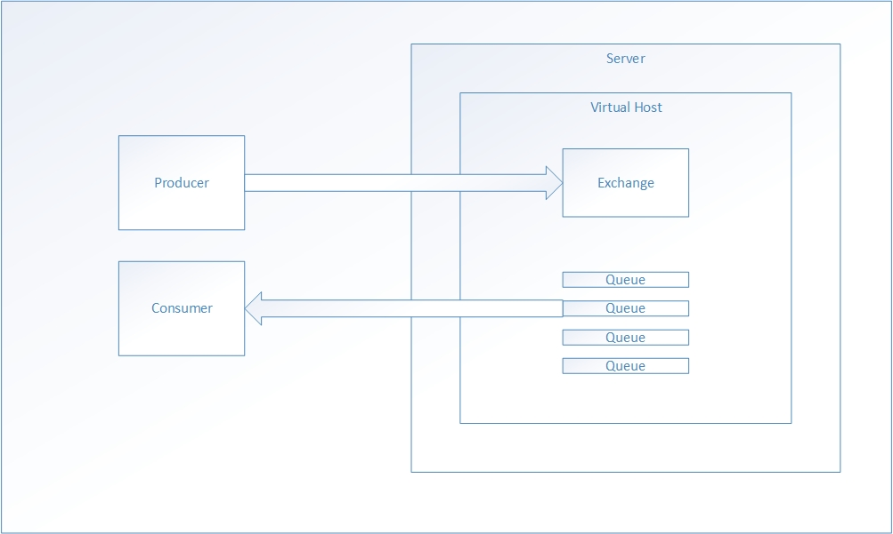
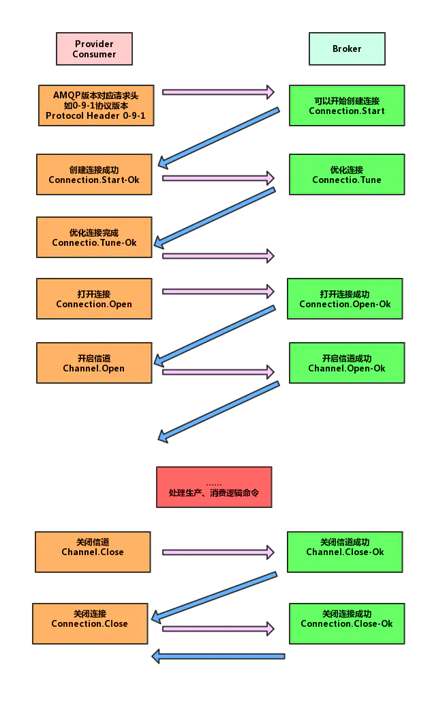
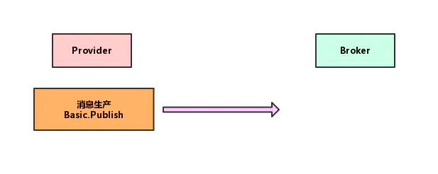
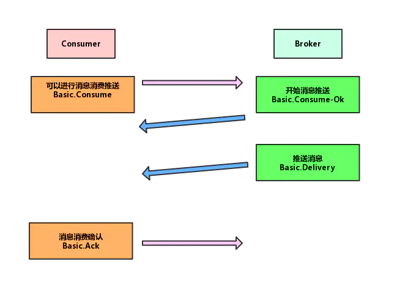

## RabbitMQ
由Erlang进行开发，基于AMQP协议，Erlang在数据交互方面性能优秀，在延迟方面能够做到和原生Socket差不多的表现。
### 应用场景
异步处理，消息放入队列中，然后立即返回，等到需要的时候才去处理。        
流量削峰，在短时间流量猛增的时候，消息队列在满了的时候可以拒绝响应，这样就能避免系统出现超负载的情况。      
进行日志处理，同样在很多场景下充当这个功能的还有kafka。     
应用解耦，这MQ的发布订阅模式，能够降低服务之间的耦合性。        
### AMQP
上面说RabbitMQ基于AMQP协议，那么这个协议到底是怎样的呢。        
AMQP是一个提供统一消息服务的应用层标准高级消息队列协议，是应用层协议的一个开放标准，为面向消息的中间件设计。        
### AMQP的几个概念
```
Server：接收客户端的连接，实现AMQP实体服务。
Connection：应用程序与Server之间的TCP连接。
Channel：信道，消息读写均在信道中进行，应用程序可以建立多个信道，每个信道代表一个会话任务。之所以在Connection的基础上多一个Channel的概念是因为，对于操作系统来说，TCP连接的建立和销毁开销很大，尤其是请求比较频繁的情况下，大量的连接的创建和销毁自然是得不偿失的，所以引入Channel用来对TCP连接进行复用，减少性能开销。
Message：应用程序和服务器之间传送的数据，有Properties和Body组成，Properties为外包装，可以对消息进行设置，比如消息的优先级，延迟等高级特性，Body则是消息体。
Virtual Host：顾名思义虚拟主机，用于逻辑隔离，一个虚拟主机可以有若干个Exchange和Queue，自然同一个虚拟主机里面不能有相同的Exchange和Queue。
Exchange：交换器，用于接收消息，同时将消息路由到多个Queue，如果路由不到，则返回给生产者或者丢弃。
Binding：绑定，交换器和消息队列之间的虚拟连接，绑定中包含若干个RoutingKey。
RoutingKey：顾名思义路由键，生产者可以将消息发送到交换机之后，会发送一个RoutingKey来指定路由规则，这样交换器就能知道将消息发送到哪个Queue，路由键通常是一个由.分割的字符串。
Queue：用来保存消息，提供给消费者消费。
```
模型：

生产者首先建立连接，开启一个Channel，然后生产者声明交换器和队列，并通过路由键将交换器和队列进行绑定，消费者那边同样如此，这些前置步骤都结束后，生产者就可以发送信息，发送到虚拟主机，虚拟主机中的Exchange通过路由将信息发送到不同的队列，订阅了消息队列的消费者级就可以获取消息。最后释放信道，连接等资源。
#### AMQP交互流程
```
1 连接的创建和销毁
连接的创建销毁包括了四个模块的通信，首先是连接创建并开启，然后是信道创建并开启，到了要关闭的时候，先是信道关闭，然后才是连接关闭，因为信道必须依赖于连接。
```

```
2 消息生产
消息生产的过程中，服务端对于这个操作时无响应的，也就是说，这个过程中如果消息出现丢失，服务端是感知不到的。
```

```
3 消息消费
消息在由服务端推向客户端后，并不会立即被删除，而只是消息状态变了，需要等待客户端的消息确认，消息确认又分几种情况，此处不细讲。
```


### 交换器
交换机的概念的提出，是因为需要让生产者解耦合，有了交换器，生产者只需要提前绑定设置好交换机和队列的关系，发送消息的时候携带路由信息，之后的逻辑交给rmq即可。不同的交换器针对不同的场景进行设计，比如将消息路由到全部队列选用fanout，将消息路由到指定的路由键队列选用direct，将消息路由到模糊匹配路由键则选用topic，最后headers，因为它的性能依赖消息头header进行规则匹配，实际生产中应用不多。
#### Direct
```
顾名思义直接的意思，也是rmq的默认交换器，即将所有发送到交换器的消息转发到RoutingKey指定的队列，也就是BindingKey和RoutingKey完全匹配的队列中。
```
#### Headers
```
这种类型不依赖路由规则来路由消息，而是根据消息内容的Headers属性进行匹配，这种了类型性能很差，实际很少用。
```
#### Fanout
```
这种类型不处理路由键，会把所有的消息路由到绑定的队列上，所以它转发消息最快，性能最好。
```
#### Topic
```
通过模式匹配分配消息的路由键属性，将路由键和某种模式进行匹配，此时队列需要绑定在一个模式上，这个模式将路由键和绑定键的字符串切分为单词，这些单词之间用点隔开，并且可以识别两种通配符，即"#"和"*"，前者可以匹配0个或者多个单词，后者仅匹配一个单词。
```
### TTL 
生存时间，RabbitMQ支持消息的过期时间，有两种：
```
1,在消息发送的时候可以进行制定，通过配置消息体的Properties，可以指定当前消息的过期时间。
2,在创建Exchange的时候指定，在进入MQ之后开始计算，只要超过了超时时间配置，那么消息就会自动清除。
```
#### 交换器和队列的创建和绑定
利用Springboot的rmq依赖实现。           
首先是direct     
```
@Configuration
public class DirectRmqConfig {

    /**
     * 队列
     * */
    @Bean
    public Queue directQueue(){
        //1，durable:是否持久化，默认是false，持久化队列会存储在磁盘上，
        // 当消息代理重启的时候依然存在，暂存队列即当前连接有效。
        //2，exclusive，默认false，只能被当前创建的连接使用，而且当连接关闭后队列就被删除
        //3，autoDelete，默认false，是否自动删除，当没有生产者或者消费者使用此队列，该队列会自动删除
        String queueName = "DirectQueue";
        return new Queue(queueName,true);
    }
    /**
     * 交换机
     * */
    @Bean
    public DirectExchange directExchange(){
        String exchangeName = "DirectExchange";
        return new DirectExchange(exchangeName,true,false);
    }

    /**
     * 绑定 将队列和交换机绑定，并设置用于匹配键
     * */
    @Bean
    public Binding directBinding(){
        String bindingKey = "DirectRouting";
        return BindingBuilder.bind(directQueue()).to(directExchange()).with(bindingKey);
    }

}
```
然后是topic，这里就可以使用之前所说的#和*了。
```
@Configuration
public class TopicRmqConfig {

    private final static String man = "Topic.man";
    private final static String woman = "Topic.woman";
    private final static String KEY_PARTTERN = "Topic.#";

    @Bean
    public Queue firstQueue(){

        return new Queue(man);
    }

    @Bean
    public Queue secondQueue(){

        return new Queue(woman);
    }

    @Bean
    public TopicExchange exchange(){

        return new TopicExchange("TopicExchange");
    }

    @Bean
    public Binding bindingExchangeMsg1(){
        //将队列和交换机绑定，并且绑定的键值设置为Topic.man
        //这样只要是消息携带的路由键是Topic.man才会发送到队列
        return BindingBuilder.bind(firstQueue()).to(exchange()).with(man);
    }

    @Bean
    public Binding bindingExchangeMsg2(){
        //Topic.man和Topic.woman都可以接收到消息
        return BindingBuilder.bind(secondQueue()).to(exchange()).with(KEY_PARTTERN);
    }
}

```
然后就是广播类型fanout了，也是依葫芦画瓢。
```
@Configuration
public class FanoutRmqConfig {


    @Bean
    public Queue queueA(){
        return new Queue("fanout.A");
    }

    @Bean
    public Queue queueB(){

        return new Queue("fanout.B");
    }

    @Bean
    public Queue queueC(){

        return new Queue("fanout.C");
    }

    @Bean
    public FanoutExchange fanoutExchange(){

        return new FanoutExchange("fanoutExchange");
    }

    @Bean
    public Binding bindingExchangeA(){

        return BindingBuilder.bind(queueA()).to(fanoutExchange());
    }
    @Bean
    public Binding bindingExchangeB(){

        return BindingBuilder.bind(queueB()).to(fanoutExchange());
    }
    @Bean
    public Binding bindingExchangeC(){

        return BindingBuilder.bind(queueC()).to(fanoutExchange());
    }

}
```
#### 生产者发送消息
代码也非常简单，以发送到上面的TopicExchange为例
```

    public String sendMessage(){
        String messageId = String.valueOf(UUID.randomUUID());
        String messageData = "Hello world,man";
        String createTime = LocalDateTime.now().format(DateTimeFormatter.ofPattern("yyyy-MM-dd HH:mm:ss"));
        Map<String,Object> map = new HashMap<>();
        map.put("msgId",messageId);
        map.put("msgData",messageData);
        map.put("createTime",createTime);
        rabbitTemplate.convertAndSend("TopicExchange","Topic.man",map);
        return "send ok";
    }
```
#### 消费者消费消息
消费者这边的主要动作是监听。
```
//监听Topic.man队列
@Component
@RabbitListener(queues = "Topic.man")
public class TopicReceiver {
    @RabbitHandler
    public void handler(Map msg){

        System.out.println("Man received:"+msg.toString());
    }
}
```
