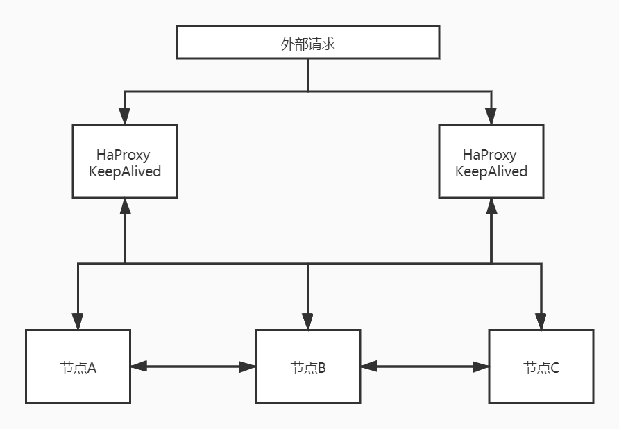
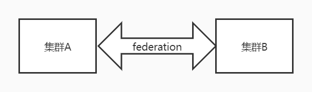

## RabbitMQ集群模式

上周被分到一个任务，就是把以前一个比较系统的接口里产生的消息通过消息队列通知给另外一个部分的服务，公司的主要使用的消息队列有两种，一种是RabbitMQ，一种是Kafka。公司的很多服务都是采取异地多活的方式部署的，消息队列的集群自然也是，每一个机房都有一个消息队列的集群。那么这个时候问题就来了，一个消息自然只发一次到集群上，但是集群有多个，该选用哪种消息队列呢，后来了解到，公司RMQ是统一管理的资源，集群支持数据同步，也就是发送消息到一个集群上，数据会自动同步到其他集群里，而Kafka都是一些团队自己用，除非自己做了一定的定制，否则是没有这方面的功能的，所以这里为了解除疑惑，就顺便来熟悉一些RMQ的集群模式。

- 主备模式

主备这个概念需要和主从区别开来，主备是读写都在主节点上，备用节只做备份不做读写操作，而主从是主节点写从节点读。主备模式主要用在并发和数据量不大的情况下。主备模式示意图如下：

- 远程模式

远程模式就像我上面所说的公司的模式了，这个模式下，可以把消息进行不同的数据中心的复制，可以让两个不同域的集群互联。

但是这个模式比较诟病的地方在于配置很复杂，现在用的已经不多了。

- 镜像模式

这个模式是现在被广泛使用的模式，它能保证高可靠性，保证数据不丢失，集群的各节点之间会实现数据同步。

- 多活模式

这里就是公司RMQ的集群模式了，在这个模式下，多个集群也能进行数据同步，官方使用federation插件进行支持，可以实现持续可靠的通信，并且配置上也不复杂。

