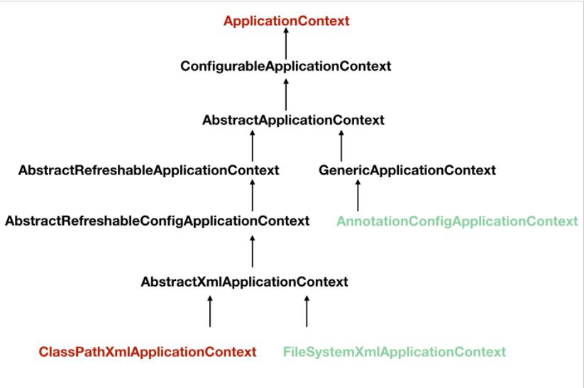
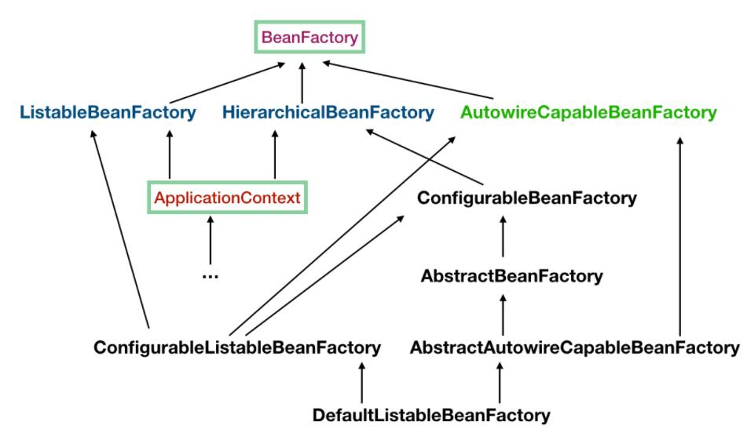

## ＩＯＣ，ＡＯＰ

### IOC

也就是控制反转，将原本在程序中手动创建对象的控制权交给spring来进行管理，IOC容器是用来实现IOC的载体，IOc容器实际上是一个Map，Map中存放的是个各种对象。

```
ApplicationContext context = new ClassPathXmlApplicationContext("classpath:applicationfile.xml");
```

学习IOC，源头在这里。ApplicationContext是一个接口。ClassPathXmlApplicationContext是实现这个接口的一种，还有其他很多种，大体上如下图。



这里还需要了解一个XXXContext，那就是AnnonationConfigApplicationContext，这个是基于注解来用的，不同于前面提到的基于配置文件的。

#### ApplicationContext实例化的过程

1，定义接口，定义实现类。

```
public interface TestService {
    void hello();
}
public class TestServiceImpl implements TestService {
    public void hello() {
        System.out.println("Hello world");
    }l
}
```

2，创建配置文件。

```
<?xml version="1.0" encoding="UTF-8" ?>
<beans xmlns:xsi="http://www.w3.org/2001/XMLSchema-instance"
       xmlns="http://www.springframework.org/schema/beans"
       xsi:schemaLocation="http://www.springframework.org/schema/beans http://www.springframework.org/schema/beans/spring-beans.xsd" default-autowire="byName">

    <bean id="testService" class="threadpool.TestServiceImpl"/>
</beans>
```

3，实例化。

```
    public static void main(String[] args){
        ApplicationContext context = new ClassPathXmlApplicationContext("classpath:app.xml");

        TestService testService = context.getBean(TestService.class);

        testService.hello();
    }
```

#### BeanFactory

负责生产和管理各个bean实例。上面的ApplicationContext实际上就是一个BeanFactory。它的主要的继承结构是：



需要明白的几点。

1,ApplicationContext 继承了ListableBeanFactory，这意味着可以获取多个bean。

2,ApplicationContext继承了HierarchicalBeanFactory，这意味着可以起多个BeanFactory，然后可以将BeanFactory设置为父子关系。

3，AutowireCapableBeanFactory，是用来自动装配bean用的，ApplicationContext并没有继承于它，但是在它的接口定义中有getAutowireCapableBeanFactory可以获取到。

4，ConfigurableListableBeanFactory，它继承于第二层的三个接口。

#### 启动过程概览

```
public class ClassPathXmlApplicationContext extends AbstractXmlApplicationContext {
    private Resource[] configResources;
......
//如果已经有ApplicationContext并且需要继承父子关系，调用这个方法
    public ClassPathXmlApplicationContext(ApplicationContext parent) {
        super(parent);
    }
......
    public ClassPathXmlApplicationContext(String[] configLocations, boolean refresh, ApplicationContext parent) throws BeansException {
        super(parent);
        //根据提供的路径，处理成配置文件数组
        this.setConfigLocations(configLocations);
        if (refresh) {
        	//核心方法
            this.refresh();
        }

    }
......
```

refresh方法的作用是将原来的ApplicationContext销毁，然后重新执行一次初始化的操作。那继续往下看。

```
    public void refresh() throws BeansException, IllegalStateException {
        Object var1 = this.startupShutdownMonitor;
        synchronized(this.startupShutdownMonitor) {
            this.prepareRefresh();
            ConfigurableListableBeanFactory beanFactory = this.obtainFreshBeanFactory();
            this.prepareBeanFactory(beanFactory);

            try {
                this.postProcessBeanFactory(beanFactory);
                this.invokeBeanFactoryPostProcessors(beanFactory);
                this.registerBeanPostProcessors(beanFactory);
                this.initMessageSource();
                this.initApplicationEventMulticaster();
                this.onRefresh();
                this.registerListeners();
                this.finishBeanFactoryInitialization(beanFactory);
                this.finishRefresh();
            } catch (BeansException var9) {
                if (this.logger.isWarnEnabled()) {
                    this.logger.warn("Exception encountered during context initialization - cancelling refresh attempt: " + var9);
                }

                this.destroyBeans();
                this.cancelRefresh(var9);
                throw var9;
            } finally {
                this.resetCommonCaches();
            }

        }
    }
```

- synchronized关键字开头，是用来防止refresh还没有结束，就有启动或者销毁的操作。

- prepareRefresh，如同他的名字，用来做准备工作的，这里主要记录容器的启动时间，标记已经启动的状态，处理配置文件中的占位符。

  然后就到了

  ```
  ConfigurableListableBeanFactory beanFactory = this.obtainFreshBeanFactory();
  ```

  看名字知道，这里是获取刷新的BeanFactory，在这一步完成之后，配置文件就会解析成为一个个的bean的定义，但是这似乎只是定义，并没有初始化。然后注册到BeanFactory中。

- 然后又是一个准备工作，prepareBeanFactory，这里是设置类加载器，添加几个BeanPostProcessor，手动注册几个特殊的Bean。

- 然后进入try语句块。

  - 首先是postProcessBeanFactory，如果一个bean实现了BeanFactoryPostProcessor接口，那么在容器初始化之后，spring会负责调用postProcessBeanFactory方法。执行了这一句的时候，所有的bean都已经加载和注册了(未初始化)。具体的子类在这一步的时候会添加一些特殊的BeanFactoryPostProcessor的实现类或者做点什么事。
  - 然后到invokeBeanFactoryPostProcessors，这里是调用BeanFactoryPostProcessor各个实现类的postProcessBeanFactory方法。
  - 然后再到registerBeanPostProcessors，这里是注册BeanPostProcessor的实现类。和BeanFactoryPostProcessor需要区分。
  - initMessageSource，初始化当前ApplicationContext的MessageSource，不赘述了。
  - initApplicationEventMulticaster，注册ApplicationContext的事件广播器，这里也不展开了。
  - onRefresh，这里是典型的模板方法，具体的子类在这里初始化一些特殊的Bean。
  - registerListeners，注册事件监听器，监听器需要实现ApplicationListener接口。
  - finishBeanFactoryInitialization，这里是重点，初始化所有的单例的bean，懒加载的除外。
  - finishRefresh，初始化完成。

  

#### 具体流程解析

- prepareRefresh

  ```
      protected void prepareRefresh() {
      	//设置启动时间
          this.startupDate = System.currentTimeMillis();
          this.closed.set(false);
          this.active.set(true);
          if (this.logger.isInfoEnabled()) {
              this.logger.info("Refreshing " + this);
          }
  
          this.initPropertySources();
          //检查xml配置文件this.getEnvironment().validateRequiredProperties();
          this.earlyApplicationEvents = new LinkedHashSet();
      }
  ```

- obtainFreshBeanFactory

  ```
  protected ConfigurableListableBeanFactory obtainFreshBeanFactory() {
      //关闭旧的Beanfactory，创建新的BeanFactory，加载Bean定义，注册Bean等等
          this.refreshBeanFactory();
          //返回刚刚创建的BeanFactory
          ConfigurableListableBeanFactory beanFactory = this.getBeanFactory();
          if (this.logger.isDebugEnabled()) {
              this.logger.debug("Bean factory for " + this.getDisplayName() + ": " + beanFactory);
          }
  
          return beanFactory;
      }
  ```

- refreshBeanFactory

  ```
      protected final void refreshBeanFactory() throws BeansException {
      //如果ApplicationContext已经加载过Beanfactory了，那么销毁所有的Bean，关闭BeanFactory。（非全局，而是判断当前ApplicationContext是否有BeanFactory）
          if (this.hasBeanFactory()) {
              this.destroyBeans();
              this.closeBeanFactory();
          }
  
          try {
          //初始化一个DefaultListableBeanFactory
              DefaultListableBeanFactory beanFactory = this.createBeanFactory();
              //用于BeanFactory的序列化
              beanFactory.setSerializationId(this.getId());
              //设置允许Bean覆盖，是否允许循环引用。
              this.customizeBeanFactory(beanFactory);
              //加载Bean到BeanFactory中
              this.loadBeanDefinitions(beanFactory);
              Object var2 = this.beanFactoryMonitor;
              synchronized(this.beanFactoryMonitor) {
                  this.beanFactory = beanFactory;
              }
          } catch (IOException var5) {
              throw new ApplicationContextException("I/O error parsing bean definition source for " + this.getDisplayName(), var5);
          }
      }
  ```

  所以ApplicationContext说到底虽然继承了BeanFactory，但是并不应该被理解为BeanFactory的实现类，而是其内部持有一个实例化的BeanFactory，所有的BeanFactory的操作都是委托这个实例来的。

  然后说一下为什么要实例化DefaultListableBeanFactory，ConfigurableListableBeanFactory只有一个实现类那就是DefaultListableBeanFactory，而且这个类还继承自AbstractAutowireCapableBeanFactory。所以它是最强的一个BeanFactory。

  - BeanDefinition，他就是spring中的Bean，我们自定义的各个bean其实就会转换成为一个个BeanDefinition存在于spring的BeanFactory中。BeanDefinition中保存了我们的bean信息，比如这个bean指向哪个类，是否是单例，这个bean一来了哪个bean等等。

  - customizeBeanFactory所设置的是否允许覆盖，是否允许循环依赖是什么呢，覆盖问题就是在配置文件中定义bean的时候使用了相同的id和name，默认的情况下，如果在同一个配置文件中重复了，会报错，如果不是在同一个配置文件中，会发生覆盖。循环依赖是指，A依赖B，B依赖C，而C依赖A，默认情况下，spring允许循环依赖。

  - 加载bean，读取配置是通过X目录BeanApplicationContext，负责加载配置和解析。最后，一个配置文件会被解析为一个DOM树。

  - 注册bean。

    ```
    // DefaultBeanDefinitionDocumentReader 116
    protected void doRegisterBeanDefinitions(Element root) {
       // 我们看名字就知道，BeanDefinitionParserDelegate 必定是一个重要的类，它负责解析 Bean 定义，
       // 这里为什么要定义一个 parent? 看到后面就知道了，是递归问题，
       // 因为 <beans /> 内部是可以定义 <beans /> 的，所以这个方法的 root 其实不一定就是 xml 的根节点，也可以是嵌套在里面的 <beans /> 节点，从源码分析的角度，我们当做根节点就好了
       BeanDefinitionParserDelegate parent = this.delegate;
       this.delegate = createDelegate(getReaderContext(), root, parent);
    
       if (this.delegate.isDefaultNamespace(root)) {
          // 这块说的是根节点 <beans ... profile="dev" /> 中的 profile 是否是当前环境需要的，
          // 如果当前环境配置的 profile 不包含此 profile，那就直接 return 了，不对此 <beans /> 解析
          // 不熟悉 profile 为何物，不熟悉怎么配置 profile 读者的请移步附录区
          String profileSpec = root.getAttribute(PROFILE_ATTRIBUTE);
          if (StringUtils.hasText(profileSpec)) {
             String[] specifiedProfiles = StringUtils.tokenizeToStringArray(
                   profileSpec, BeanDefinitionParserDelegate.MULTI_VALUE_ATTRIBUTE_DELIMITERS);
             if (!getReaderContext().getEnvironment().acceptsProfiles(specifiedProfiles)) {
                if (logger.isInfoEnabled()) {
                   logger.info("Skipped XML bean definition file due to specified profiles [" + profileSpec +
                         "] not matching: " + getReaderContext().getResource());
                }
                return;
             }
          }
       }
    
       preProcessXml(root); // 钩子
       // 往下看
       parseBeanDefinitions(root, this.delegate);
       postProcessXml(root); // 钩子
    
       this.delegate = parent;
    }
    ```


### 还需要复习

IOC底层，AOP底层